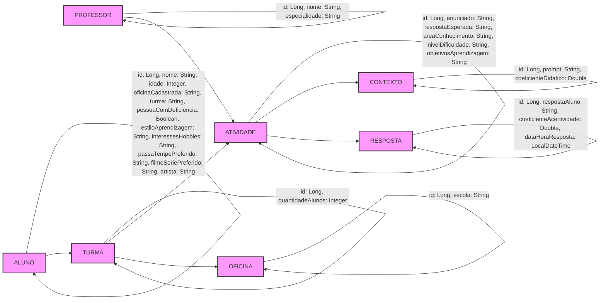

# Smart Broker API G10

## Descrição

A `Smart Broker API G10` é uma API desenvolvida em Kotlin e Java utilizando o framework Spring Boot. Esta API é projetada para gerenciar entidades como Aluno, Atividade, Professor e Contexto, além de se comunicar com a API do ChatGPT para enriquecer correções.

## Estrutura do Projeto

A estrutura do projeto segue uma arquitetura limpa, dividida em várias camadas para separar as responsabilidades e facilitar a manutenção e evolução do código.

```
smart_broker_api_g10
│
├── adapters                  // Adaptadores que conectam a aplicação com o mundo externo (controladores e gateways)
│   ├── controllers            // Controladores REST que recebem requisições HTTP e delegam para os casos de uso
│   └── output                 // Implementações de saída, como gateways para comunicação com APIs e repositórios
│       ├── gateways           // Gateways de saída que fazem a comunicação com fontes externas, como banco de dados e APIs externas
│       └── repositories       // Repositórios JPA para interação com o banco de dados
│
├── application               // Camada da lógica de aplicação
│   ├── ports                 // Portas que conectam o núcleo da aplicação aos adaptadores
│   │   ├── input             // Interfaces de entrada (usadas pelos controladores para os casos de uso)
│   │   └── output            // Interfaces de saída (usadas pelos gateways para comunicação com APIs externas e banco de dados)
│   └── usecases              // Casos de uso que contêm a lógica de negócio da aplicação
│
├── domain                    // Camada do domínio (contém as entidades e regras de negócio)
│   ├── models                // Modelos de domínio (representações das entidades do mundo real, sem dependências externas)
│   ├── services              // Serviços de domínio que encapsulam a lógica de negócio
│   └── entities              // Entidades que são mapeadas para o banco de dados
│
├── shared                    // Classes e componentes compartilhados em toda a aplicação
│   ├── dto                   // Objetos de Transferência de Dados (Data Transfer Objects)
│   └── exceptions            // Classes relacionadas ao tratamento de exceções globais
```

## Funcionalidades

### Gerenciamento de Aluno
- **Buscar Aluno por ID**
- **Salvar Aluno**
- **Atualizar Aluno**

### Gerenciamento de Atividade
- **Buscar Atividade por ID**
- **Salvar Atividade**
- **Atualizar Atividade**

### Gerenciamento de Professor
- **Buscar Professor por ID**
- **Salvar Professor**
- **Atualizar Professor**

### Gerenciamento de Contexto
- **Buscar Contexto por ID**
- **Salvar Contexto**
- **Atualizar Contexto**

### Integração com API do ChatGPT
- **Enriquecer Correção**: Envia uma solicitação para a API do ChatGPT e retorna a resposta enriquecida.

## Tecnologias Utilizadas

- **Kotlin**
- **Java**
- **Spring Boot**
- **Maven**
- **WebClient** (para comunicação com APIs externas)
- **Jackson** (para serialização e desserialização de JSON)

## Como Executar

1. **Clone o repositório:**
   ```bash
   git clone https://github.com/cassiorobertogs/smart_broker_api_g10.git
   cd smart_broker_api_g10
   ```

2. **Compile e execute a aplicação:**
   ```bash
   ./mvnw spring-boot:run
   ```

3. **Acesse a API:**
   A API estará disponível em `http://localhost:8080`.

## Contribuição

1. **Fork o projeto**
2. **Crie uma branch para sua feature (`git checkout -b feature/nova-feature`)**
3. **Commit suas mudanças (`git commit -am 'Adiciona nova feature'`)**
4. **Push para a branch (`git push origin feature/nova-feature`)**
5. **Abra um Pull Request**

## Banco de Dados

### Diagrama Entidade-Relacionamento (ER)

O diagrama representa um modelo de banco de dados, com várias entidades conectadas por relações entre elas. Cada entidade contém atributos que definem suas características. Abaixo estão as entidades e seus respectivos atributos, seguidos pelos relacionamentos entre elas:

Entidades e seus atributos:
ALUNO:

id (Long): Identificador único do aluno.
nome (String): Nome do aluno.
idade (Integer): Idade do aluno.
oficinaCadastrada (String): Oficina na qual o aluno está inscrito.
turma (String): Turma do aluno.
pessoaComDeficiencia (Boolean): Indica se o aluno possui alguma deficiência.
estiloAprendizagem (String): Estilo de aprendizagem do aluno.
interessesHobbies (String): Interesses e hobbies do aluno.
passaTempoPreferido (String): Atividades preferidas no tempo livre.
filmeSeriePreferido (String): Filme ou série favorita.
artista (String): Artista favorito.
ATIVIDADE:

id (Long): Identificador único da atividade.
enunciado (String): Enunciado da atividade.
respostaEsperada (String): Resposta esperada para a atividade.
areaConhecimento (String): Área do conhecimento a que a atividade pertence.
nivelDificuldade (String): Nível de dificuldade da atividade.
objetivosAprendizagem (String): Objetivos de aprendizagem da atividade.
PROFESSOR:

id (Long): Identificador único do professor.
nome (String): Nome do professor.
especialidade (String): Especialidade do professor.
CONTEXTO:

id (Long): Identificador único do contexto.
prompt (String): Prompt que guia a atividade.
coeficienteDidatico (Double): Coeficiente didático usado para gerar feedback personalizado.
OFICINA:

id (Long): Identificador único da oficina.
escola (String): Nome da escola onde a oficina é realizada.
TURMA:

id (Long): Identificador único da turma.
quantidadeAlunos (Integer): Quantidade de alunos na turma.
RESPOSTA:

id (Long): Identificador único da resposta do aluno.
respostaAluno (String): Resposta dada pelo aluno.
coeficienteAcertividade (Double): Avaliação da precisão da resposta.
dataHoraResposta (LocalDateTime): Data e hora da resposta.
Relacionamentos:
ALUNO está associado a uma TURMA.
TURMA pode realizar várias ATIVIDADES.
Um PROFESSOR cria uma ATIVIDADE.
Cada ATIVIDADE está associada a um CONTEXTO.
ATIVIDADE está ligada a uma ou mais RESPOSTAS dos alunos.
Uma TURMA pertence a uma OFICINA.



## Licença

Este projeto está licenciado sob a licença MIT. Veja o arquivo [LICENSE](LICENSE) para mais detalhes.